<div align="center"></div>

<div align="center">



<br/>


</div>

---

<div align="center"></div>

<br/>

<div align="center"></div>

<br/>

> **HackX 4.0** is not just a hackathon — it's a **24-hour Grand Prix of ideas**, hosted at **NMIMS, Navi Mumbai**. The sharpest student developers, designers, and problem-solvers strap in, hit the throttle, and race to build real-world solutions from concept to deployment — all in one relentless, non-stop sprint.
>
> Think critically. Code fast. Innovate boldly. **This is your race.**

---

## 🏆 PRIZE GARAGE

<div align="center">

| 🥇 P1 — Grand Prix | 🥈 P2 — Runner Up | 🥉 P3 — Second Runner Up | 🎖️ All Finishers |
|:------------------:|:-----------------:|:------------------------:|:----------------:|
| **₹35,000** | **₹25,000** | **₹15,000** | Certificates + Internship Opps |

### 🎁 All winners receive: Logitech Goodies + Swag Pack
### 💰 Total Prize Pool: ₹75,000

</div>

---

## 🔩 PROBLEM STATEMENTS — PICK YOUR CIRCUIT

<br/>

### `PS-01` &nbsp; AI / DevSecOps
**The Vibe-Audit** — *Production-Ready Gatekeeper*

Build an automated gatekeeper that scans AI-generated *(vibe-coded)* repos and produces a structured **Go/No-Go production readiness report** — covering secrets detection, compliance checks, and dependency auditing.

<br/>

### `PS-02` &nbsp; AI / Agents
**Curvet AI** — *The SME-Plug · Hot-Swappable Expert Plugin*

Design a universal skill plugin that injects **specialized domain knowledge and structured reasoning** into any AI agent framework — enforcing source-of-truth citations and domain-specific decision trees.

<br/>

### `PS-03` &nbsp; SaaS / Ops
**Prasad Food Divine** — *Banquet Management · End-to-End Event Platform*

Build a centralized multi-branch banquet management platform covering **lead tracking, real-time booking, event coordination, vendor management, billing automation**, and analytics dashboards.

<br/>

### `PS-04` &nbsp; Analytics / CX
**Prasad Food Divine** — *Review Management · Centralized Feedback Intelligence*

Develop a platform that **aggregates reviews from Google, Zomato, and internal forms**, auto-categorizes feedback, generates AI-assisted responses, and delivers branch & staff performance insights.

<br/>

### `PS-05` &nbsp; Distributed Systems
**Cosmeon** — *FS-Lite · Orbital File System Simulation*

Build a lightweight distributed file system that **splits files into chunks and distributes them across simulated satellite nodes** — with on-demand reconstruction, integrity checks, and failure simulation.

<br/>

### `PS-06` &nbsp; ML / Geo
**Cosmeon** — *Satellite Insight Engine · Climate Risk from Orbital Data*

Build a pipeline that ingests open satellite imagery *(Sentinel/Landsat)*, performs **automated flood detection and environmental risk analysis using ML**, and outputs structured, decision-ready climate risk insights.

---

<div align="center"></div>

<div align="center"></div>

<div align="center">

| 🕐 Time | Pit Stop | Status |
|:-------:|:--------:|:------:|
| **8:30 AM** | 🔴 CHECK-IN | Reporting — scrutineering & paddock entry |
| **9:00 AM** | 📋 OFFICIALS | Registrations open — driver livery collection |
| **10:30 AM** | 🟡 FORMATION LAP | Opening Ceremony — system diagnostics complete |
| **12:00 PM** | 🟢 **RACE START** | **Green flag! 24-hour clock begins. ERS enabled.** |

</div>

<div align="center"></div>

<div align="center">

| 🕐 Time | Pit Stop | Status |
|:-------:|:--------:|:------:|
| **5:00 PM** | ☕ HIGH TEA | Afternoon refresh — fuel & tire management |
| **7:00 PM** | 🛠️ PIT STOP I | Mentorship Round I — mid-race strategy tuning |
| **8:00 PM** | 🍽️ DINNER | Evening fuel stop — energy replenishment |

</div>

<div align="center"></div>

<div align="center">

| 🕐 Time | Pit Stop | Status |
|:-------:|:--------:|:------:|
| **8:30 AM** | 🌅 BREAKFAST | Morning boost — fresh tires, new strategy |
| **9:00 AM** | 🏎️ FINAL STINT | Mentorship Round II — push for fastest lap |
| **12:00 PM** | 🏁 **RACE END** | **Chequered flag — submissions closed** |

</div>

<div align="center"></div>

<div align="center">

| 🕐 Time | Pit Stop | Status |
|:-------:|:--------:|:------:|
| **12:15 PM** | 🥗 LUNCH | Post-race recovery mode |
| **1:00 PM** | ⚖️ JUDGING | Technical inspection — stewards review begins |
| **4:00 PM** | 🏆 **PODIUM** | **Results & Closing Ceremony — Victory lap!** |

</div>

---

## 🧑‍💻 DRIVER SPECS

```
TEAM SIZE   →  2 – 4 members
ELIGIBILITY →  Students only  
FORMAT      →  Offline · On-site
VENUE       →  NMIMS, Navi Mumbai
DURATION    →  24 Hours non-stop
```

---

<div align="center">

[](https://git.io/typing-svg)

<br/>

*Made with ❤️ and full throttle by the HackX Team · NMIMS Navi Mumbai*

</div>
